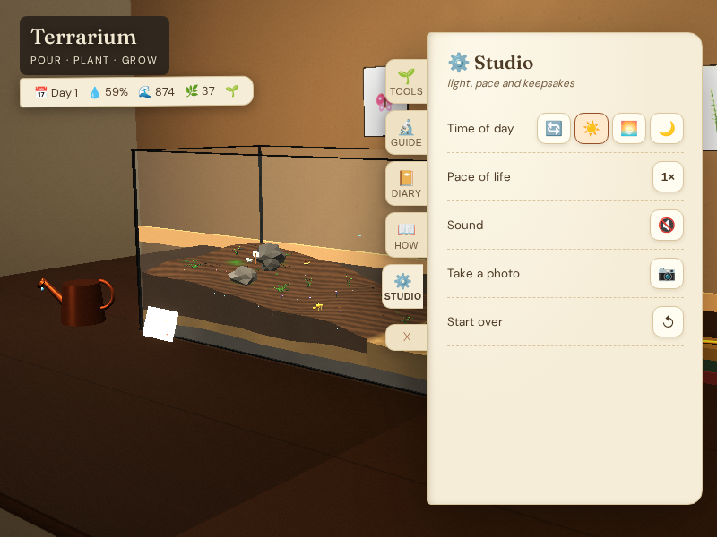

# Terrasim

I built a browser terrarium where I can pour soil and water, plant a garden, and return to it later.

**Question:** Can simple water and plant-care rules make a small digital garden feel alive?

My [world model](src/core/World.ts) tracks layered terrain, moisture, growth, wilting and composting. [Procedural meshes](src/world/PlantMeshes.ts) draw the plants; the [application loop](src/main.ts) connects editing, lighting, sound, a diary, browser-local saving and PNG photos. This is a playable illustration, not a validated ecosystem model.



[Pages address](https://mottopanikeiku.github.io/terrasim/) — the repository owner must enable GitHub Pages with **GitHub Actions** as its source before deployment is available.

## Play

I use Node.js 22, npm and a WebGL-capable browser. No API key, server account, model download or paid compute is needed.

```sh
npm ci
npm run dev -- --host 127.0.0.1 --open false
npm run build
```

Open the URL printed by Vite. Choose a tool in the journal. Hold left mouse to pour or dig; click to plant; right-drag to orbit; scroll to zoom. On touch, drag to orbit and tap to act. The Studio has lighting, time speed, sound, photo and reset controls.

For keyboard use, Tab through the journal and activate a tool with Enter. Focus moves to the tank: arrows move the terrain target, Enter applies once, and holding Space pours or digs. Escape stops pouring. Shift + arrows orbit, +/− zoom, and Home fits the tank. Closing the journal returns focus to its bookmark. The welcome dialog supports Escape and keeps focus inside while open.

## Rendering and checks

I keep the existing [30 Hz gameplay simulation](src/main.ts) separate from drawing. The [render policy](src/core/RenderPolicy.ts) caps drawing at 45 frames per second on desktop and 30 on compact/touch screens, lowering it to 24 under sustained pressure. Pixel ratio is capped at 1.5 and limited by a pixel budget; shadows adapt between 512 and 1536 pixels. Recovery needs sustained headroom, and hidden tabs do not draw. These are policies, not measured speed claims or a device-support guarantee.

[CI](.github/workflows/pages.yml) builds the app, runs [policy unit tests](tests/render-policy.test.ts), and checks desktop/mobile keyboard flows, local saving and journal accessibility with [Playwright and axe](tests/browser/terrarium.spec.ts). It deploys only the default branch after those checks. Vite emits relative asset paths for repository subpaths. To run the checks after building:

```sh
npm test && npx playwright install chromium && npm run test:browser
```

## Limits and prior work

- Care and water transport are hand-tuned game rules, not botanical advice.
- Terrain is a heightfield; it cannot represent caves or overhangs.
- Random events and away-time approximation are not a scientific simulation.
- Saves stay in this browser; there is no account or portable save export.
- I have not measured mobile performance. The interface requests Google Fonts.

I use [Three.js](https://threejs.org/docs/) for rendering and controls, [Vite](https://vite.dev/guide/) for bundling, and [Web Audio](https://developer.mozilla.org/en-US/docs/Web/API/Web_Audio_API) for synthesized sound. The [original design brief](docs/original-design-brief.md) preserves historical ideas and unmeasured targets.

Written with AI coding assistance.
